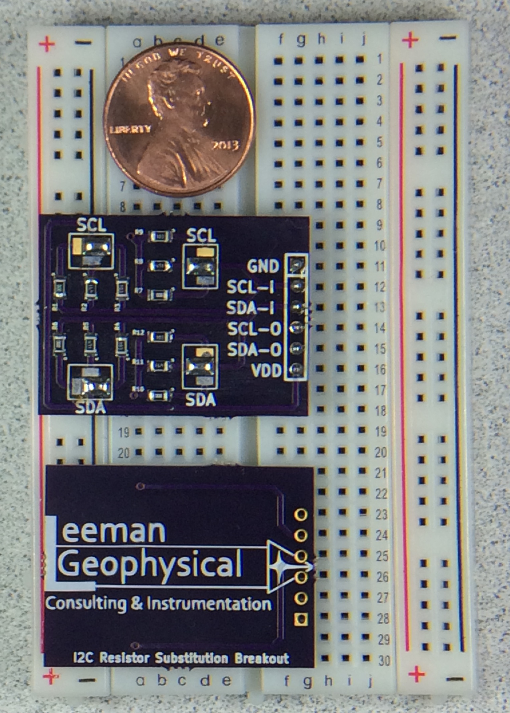

# I2C Pullup Breakout

## Purpose

Prototyping aid that allows selectable pull-up and series resistors for the I2C
bus. To use, just insert the module into your circuit/breadboard and select the
appropriate series/pull up resistor values with the solder  jumpers. Bridging
the jumpers is very easy and switching usually just requires a swipe with the
soldering iron.

## Purchasing

The I2C Pullup Breakout is available through Leeman Geophysical by emailing
[John R. Leeman](http://www.johnrleeman.com) at <kd5wxb@gmail.com>.

## Project Information

This repository includes all design information, CAD files, PDF CAD output,
gerbers, etc.

Additional resources for this project include:

- [Bill of Materials](BoM.md) (BoM)

## License

This product is licenced under the CERN Open Hardware License 1.2. The [full
license](cern_ohl_v_1_2.txt) is included in this repository. 
